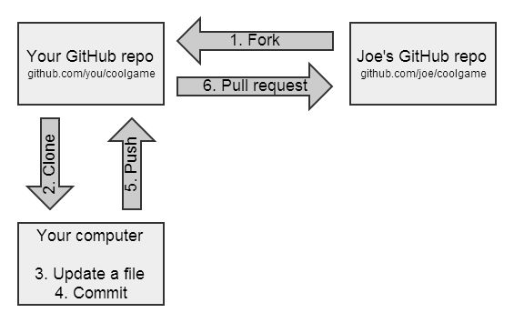

* content
{:toc}


## git概念


* 工作区（worktree）：指的是当前编写文档的位置
* 暂存区：指的是一个index文件，称为stage区，通过add命令追踪的文件会被添加到这个文件中
* 版本库：包含所有版本和分支的信息
* 远程仓库：指的是远程服务器上的版本库

把文件往Git版本库里添加的时候，是分两步执行的：

第一步是用git add把文件添加进去，实际上就是把文件修改添加到暂存区；

第二步是用git commit提交更改，实际上就是把暂存区的所有内容提交到当前分支。

因为我们创建Git版本库时，Git自动为我们创建了唯一一个master分支，所以，现在，git commit就是往master分支上提交更改。

你可以简单理解为，需要提交的文件修改通通放到暂存区，然后，一次性提交暂存区的所有修改。


## git提交本地项目到github
* 在本地git上面创建好git仓库
	- 首先配置好身份
    ```
    $ git config --global user.name "yourname"
    $ git config --global user.email youremail
    ```
    - 进入项目目录并创建本地仓库，执行完目录下会有隐藏文件.git
    ```
    $ cd e:yourproject/
    $ git init
    ```
    - 添加文件，git add .为添加所有文件
    ```
    $ git add yourfile
    $ git add .
    ```
	- 提交到本地仓库
   	```
    $ git commit -m "commit msg"
    ```
* 在github上创建好仓库
    - 连接到github远程仓库
    ```
    $ git remote add [origin] http://github.com/...
    ```
    - 推送本地项目到github上的master分支，我们第一次推送master分支时，加上了-u参数，Git不但会把本地的master分支内容推送的远程新的master分支，还会把本地的master分支和远程的master分支关联起来，在以后的推送或者拉取时就可以简化命令。origin为远程源的名字，默认为origin，也可以为其他名字，当添加多个远程源的时候可以自行命名区分。
    ```
    $ git push -u origin master
    ```
    - 如果此时出现冲突主要是因为本地仓库没有README.md文件，进行代码合并，随后再次进行push
    ```
    $ git pull --rebase origin master
    ```

## git提交本地库修改到github
* 定位到本地库位置
	- 定位
	```
    $ cd e:yourproject/
    ```
* 提交
    - 添加项目目录下的所有文件到缓冲区（Index）
    ```
     $ git add .
    ```
	- 提交到本地仓库并记录提交信息
   	```
    $ git commit -m "commit msg"
    ```
    - 以上两步可以合并为
    ```
    $ git commit -a -m "commit msg"
    ```
    - 连接到github远程仓库，如果之前连接过了可以跳过这一步
    ```
    $ git remote add origin http://github.com/...
    ```
    - 推送本地项目到github上的master分支
    ```
    $ git push origin master
    ```

##git克隆他人项目到本地开发
* 定位到本地库位置
	- 把远程版本库克隆到本地
    ```
    $ git clone http://github.com/... [localfile]
    ```

## git常用操作命令

- 显示上次的改动
	```
    $ git status -s
    ```
- 删除远程服务器上面的某个文件或文件夹但不影响本地文件夹
	```
    $ git rm -r --cached [filename]
    $ git commit -m "remove msg"
    $ git push -u origin master
    ```
- 删除本地文件同时提交远程服务器
	```
    $ git rm -rf dir
    $ git commit -m "remove msg"
    $ git push -u origin master
    ```
- 与上次的提交做比较
	```
    $ git diff [filename]
    ```
- 查看各个版本历史（commit提交历史），其中commit的版本号为SHA1计算出来的，运用时只需要前7位
	```
    $ git log [--pretty=oneline]
    ```
- 查看命令执行历史
	```
    $ git reflog
    ```
- 版本回退，在Git中，用HEAD表示当前版本，上一个版本就是HEAD^，上上一个版本就是HEAD ^^，当然往上100个版本写100个 ^比较容易数不过来，所以写成HEAD~100
	```
    $ git reset --hard [HEAD^|commit id]
    ```
- 撤销工作区修改（执行add命令之前）
	```
    $ git checkout -- [filename]
    ```
- 撤销暂存区修改（执行add命令之后）
	```
    $ git reset HEAD [filename]
    ```
- 创建分支，切换分支，创建并切换分支，创建远程关联分支
	```
    $ git branch [branch name]
    $ git checkout [branch name]
    $ git checkout -b [branch name]
    $ git checkout -b dev origin/dev
    ```
- 合并分支（fast forward模式，只是将指针快速指向后者）
	```
    $ git merge [branch name]
    ```
- 合并分支（禁用fast forward模式，git在merge的时候会生成一个新的commit，就能看出原来曾经做过合并）
	```
    $ git merge --no-ff -m "message" [branch name]
    ```
- 删除分支
	```
    $ git branch -d [branch name]
    ```
- 查看分支合并图
	```
    $ git log --graph
    $ git log --graph --decorate --oneline --simplify-by-decoration --all
    ```
- 删除远程分支
	```
    $ git remote rm [remote name]
    ```
- 为命令配置别名（例如status改为st，仅对当前用户有效，配置文件放在.gitconfig下）
    ```
    $ git config --global alias.st [status]
    ```
- 保存工作现场
	```
    $ git stash // 保留工作现场
    $ git stash list  // 查看保留的线程
    $ git stash apply // 恢复工作现场
    $ git stash drop // 删除某个保留的工作现场
    $ git stash pop // 恢复现场并把stash内容删除
    ```
- 丢弃一个没有被合并过的分支
	```
    $ git branch -D [branch name]
    ```
- 切换到本地dev分支，拉取远程仓库dev分支信息，指定本地dev分支和远程分支的连接
	```
    $ git checkout dev
    $ git pull origin dev
    $ git branch --set-upstream-to origin/dev
    ```
- 本地分支与远程分支建立链接关系
	```
    $ git branch --set-upstream-to [origin/branch-name]
    ```
- 在本地创建和远程分支对应的分支
	```
    $ git checkout -b [branch-name] [origin/branch-name]
    ```
- 合并分支，但是保留分支提交历史，被合并的分支没有另一个分支的提交，但是合并的那个分支却有被合并分支的提交内容，合并的分支所有提交历史会合并这些内容并生成新的提交记录，之前的提交记录会被gc回收
	```
    $ git rebase [branch name]
    ```
- 拉取远程仓库更新内容
	```
    $ git pull [origin] [branch]
    # 等价于
    $ git fetch [remote url]
    $ git merge FETCH_HEAD
    ```
- 拉取远程仓库更新内容但不会合并你的分支，而是拉取更新内容并保留你的分支
	```
    $ git pull --rebase [origin] [branch]
    ```


- .gitignore文件配置，提交时遵守这些规则
	```
    #ignore own file

    /target/

    .classpath

    .project

    .settings

    #class file

    *.class

    *.log

    #Windows

    Thumbs.db

    ehthumbs.db

    Desktop.ini
    ```

## Other
* 在Git中，一次commit相当于一次快照存取，即一次版本记录，有利于我们后面随时回退某个版本。

* HEAD就是指向当前版本。HEAD^指向上一个版本。

* Git的工作目录下，分为工作区和版本库，版本库就保存在.git文件中。.git文件中保存着重要文件，如果该文件被删除之后则会丢失所有数据，包括提交历史和版本状态以及和远程仓库的同步等等。在.git中，又分为暂存区stage和git为我们自动创建的master分支，以及指向master分区的指针HEAD。我们在执行git add的时候其实是将文件修改添加到暂存区，执行git commit的时候是将暂存区的所有内容提交到当前分支。

**clone和fork的区别**
1.区别：
git clone 是在自己电脑（这里我是ubuntu）直接敲命令，结果是将github仓库中的项目克隆到自己本地电脑中了

fork是直接访问github网站，在项目页面中点击fork，然后自己github项目中就会多出一个复制的项目

2.用法：
如果我们想要修改他人github项目的话，我们直接git clone代码到本地是不能pull的，所以我们使用fork，先把代码复制到自己的github仓库，然后git clone到本地修改，然后在提交pull（这里的pull是pull到自己github仓库了，我们自己的github仓库中的代码是fork源的一个分支），这时候我们想要把修改的代码提交给他人的话，就可以在自己github上pull，等其他人看到后就可以把代码做一个合并



## 使用SSH Key

**首先本地生成密钥对，即公钥和私钥**
```
$ ssh-keygen -t rsa -C "your_email@youremail.com"
```

**查看~/.ssh/目录下生成的密钥对**
```
id_rsa ：密钥
id_rsa.pub ：公钥
```

**将公钥添加到github的SSH Key上**
登陆你的github帐户。然后 Account Settings -> 左栏点击 SSH Keys -> 点击 Add SSH key
然后你复制上面的公钥内容，粘贴进“Key”文本域内。 title域，你随便填一个都行。
完了，点击 Add key。

**验证SSH Key**
```
$ ssh -T git@github.com
```

**修改本地的提交方式为SSH**
```
git remote set-url origin [your remote url]
```

## merge和rebase的区别

假设现在我们有分支A和分支B，如下：


1） 在分支A上使用git merge B，提交日志则如下所示。可以看到生成了一个新的提交，这个提交合并了分支A和分支B，如果有冲突的话，还会让我们手动解决冲突后再提交。此时分支A的提交历史还可以查到。


2） 在分支A上使用git rebase B，提交日志则如下所示。可以看到两个分支合并成了一个分支线。先是把分支B的新增内容加到分支A上，然后再加上分支A的新增内容，此时分支A的新增内容有部分被修改，即原来的C1会随分支B的修改而修改，然后再加上分支B的新增内容。前一部分有点改变基础内容的意味，很符合rebase的意思，而分支A原来的提交历史C3则丢失了，即不能回滚到原来的C3了。


**总结**

通过上面的比较我们可以看到merge操作保留了提交历史和分支信息，而rebase则是将提交分支合并成了一条线，在实际使用中，我们要慎用rebase，对于本地清除额外的分支线，保持分支的干净，我们可以使用rebase，但是提交到远程仓库，则尽量使用merge保留分支提交历史。

## Git LFS


Git LFS(Large File Storage) 是 Github 开发的一个 Git 的扩展，用于实现 Git 对大文件的支持。

Git LFS将你所标记的大文件保存至另外的仓库,而在主仓库仅保留其轻量级指针。
那么在你检出版本时,根据指针的变化情况下更新对应的大文件，而不是在本地保存所有版本的大文件。

**使用**

首先需要在操作系统安装Git LFS，需要 Git 的版本不低于 1.8.5。

1. 执行 git lfs install 开启lfs功能
2. 使用 git lfs track 命令进行大文件追踪 例如git lfs track "*.png" 追踪所有后缀为png的文件
3. 使用 git lfs track 查看现有的文件追踪模式
4. 提交代码需要将gitattributes文件提交至仓库. 它保存了文件的追踪记录
5. 提交后运行git lfs ls-files 可以显示当前跟踪的文件列表
6. 将代码 push 到远程仓库后，LFS 跟踪的文件会以『Git LFS』的形式显示
7. clone 时 使用'git clone' 或 git lfs clone均可